<div class='timeline'>intro-anato-<span class='highlight'>simul:IHC</span>-conclu
</div>


# Sound Localization Basics
auth: Paolo Marzolo
adv:  Francesco De Santis

---
# Table of contents
<div class="twocols">
<div>

1. introduction
    - task definition
    - why it's interesting
    - basic concepts
1. anatomical 
    - overall structure
    - my part
</div>
<div>

3. simulation
    - nest and architecture
    - brian2-brian2hears
    - my implementation and workflow
4. conclusion
</div>

---
# Introduction
- double presentation
- objectives:
    - familiarize audience with the subjects
    - present what i've been working on
    - get some more presentation practice
- feedback welcome!

---
## Task definition
> The ability to identify the location of a sound source in a sound field. <span class='cite text-small'>(Jutras et al., 2020)</span>

<div class="twocols mt-0">
<div>


### humans
- report verbally <span class='text-small'>(Wightman and Kistler, 1992)</span>
</div>


---

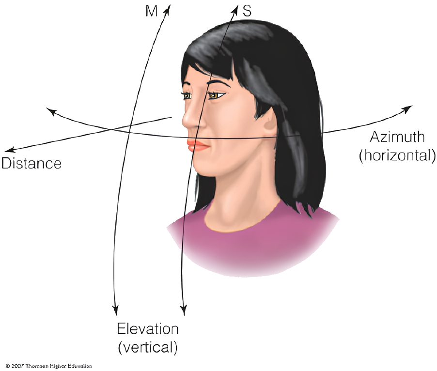

> a subject might call out the coordinates "minus 45, 30," indicating that the sound came from 45° to the left of the subject and from 30° above the horizontal plane.
\
(Wightman and Kistler, 1992)

---
## Task definition
> The ability to identify the location of a sound source in a sound field. <span class='cite text-small'>(Jutras et al., 2020)</span>

<div class="twocols mt-0">
<div>

### humans
- report verbally <span class='text-small'>(Wightman and Kistler, 1992)</span>
- nose pointing <span class='text-small'>(Makous and Middlebrooks, 1990)</span>
* God's eye <span class='text-small'>(Gilkey et al., 1995)</span>
</div>

---


---
## Task definition
> The ability to identify the location of a sound source in a sound field. <span class='cite text-small'>(Jutras et al., 2020)</span>

<div class="twocols mt-0">
<div>

### humans
- report verbally <span class='text-small'>(Wightman and Kistler, 1992)</span>
- nose pointing <span class='text-small'>(Makous and Middlebrooks, 1990)</span>
- God's eye <span class='text-small'>(Gilkey et al., 1995)</span>
</div>
<div>

### other mammals
- mostly MAA:
    - 2AFC
</div>
</div>

---

(Tolnai et al., 2017) - virtual headphones

---
## Task definition
> The ability to identify the location of a sound source in a sound field. <span class='cite text-small'>(Jutras et al., 2020)</span>

<div class="twocols mt-0">
<div>

### humans
- report verbally <span class='text-small'>(Wightman and Kistler, 1992)</span>
- nose pointing <span class='text-small'>(Makous and Middlebrooks, 1990)</span>
- God's eye <span class='text-small'>(Gilkey et al., 1995)</span>
</div>
<div>

### other mammals
- mostly MAA:
    - 2AFC
- 6 AFC alternative for SNR
</div>
</div>

---
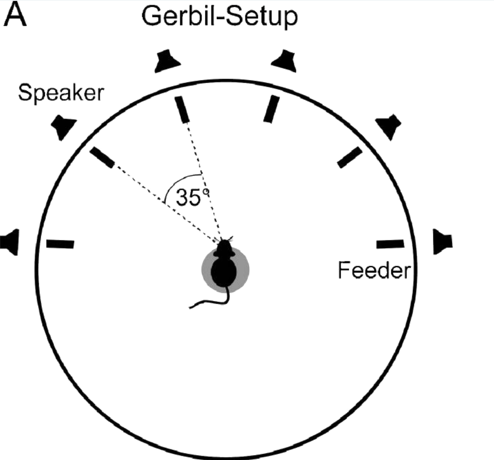
(Lingner et al., 2012) - sound localization SNR

---
## why it's interesting
<br/><br/>

1. point-like sensor to spatial
1. limited cues are enough to accomplish it
1. evolutionary perspective

---
## why it's interesting
1. point-like sensor to spatial -> consider vision and somatosensation
1. limited cues are enough to accomplish it
1. evolutionary perspective
---

## why it's interesting

1. point-like sensor to spatial -> consider vision and somatosensation
1. ### limited cues are enough to accomplish it
    - 3 classes of cues: ITD, ILD, spectral

---
<br/>


(Grothe and Pecka, 2014)

---
## why it's interesting

1. point-like sensor to spatial -> consider vision and somatosensation
1. ### limited cues are enough to accomplish it
    - 3 classes of cues
    * spectral cues don't change in horizontal -> binaural
    * small ranges: ITD $\in [\pm 0.6 \micro s ]$, ILD $\in [\pm 50dB ]$
    * ITD viable in larger heads, ILD frequency dependent
        - ILD high freq affected most (Rayleigh, 1875)
        - for humans, viable >1.3 kHz 

---


<!-- 
the generalization of these cues, which is the sum of all possible aspects that differentiate how the sound arrives to one eardrum from the other, are called the head related transfer functions
-->
---
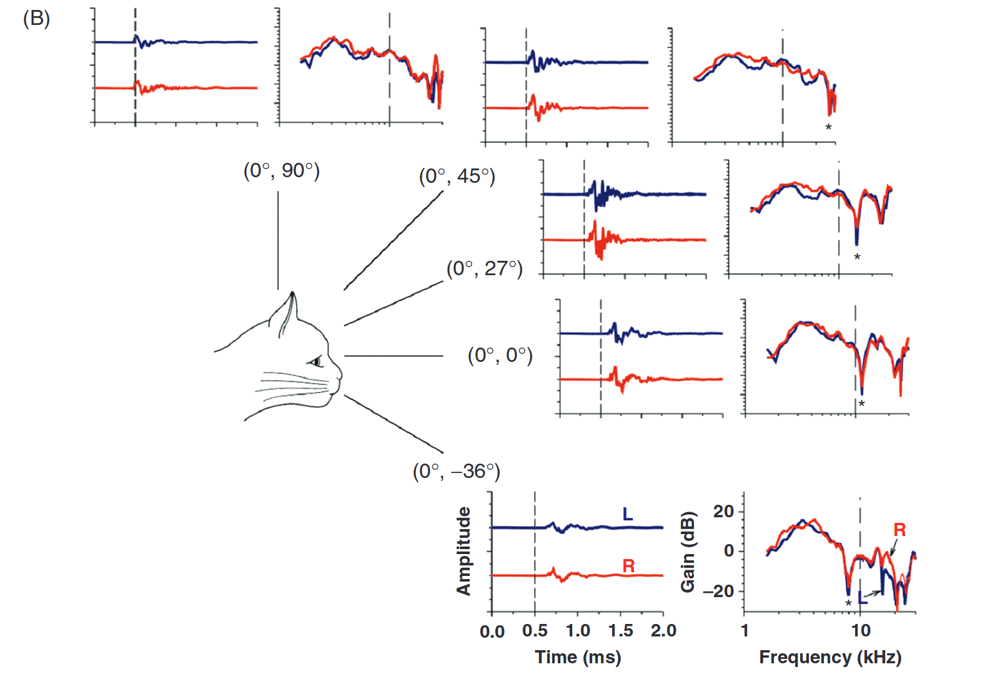

---

## why it's interesting

1. point-like sensor to spatial -> consider vision and somatosensation
1. limited cues are enough to accomplish it
3. ### evolutionary perspective
    * independent evolution (Grothe and Pecka, 2014)

---

<!-- 
common evolutionary pressure is unclear for now
this also means possibly independent solutions! -->

---

## why it's interesting

1. point-like sensor to spatial -> consider vision and somatosensation
1. limited cues are enough to accomplish it
1. ### evolutionary perspective
    - independent evolution (Grothe and Pecka, 2014)
    - diets changed to seeds, depriving three ossicles of their function
    * only small, nocturnal mammals survived
    * mother-pup communication calls outside reptilian-bird hearing range

---

## basic concepts: review
<br/>

1) ILD, ITD, spectral cues
1) HRTFs contain all of them
1) specialized anatomical and physiological properties not found anywhere else
1) parallel evolution means different mechanisms may be in use in different _classes_

---
# what is my role in all this?
<br/>

- as a compu neuro, I cannot prove or disprove anything definitively
- various models of how sound localization is achieved exist
- bring evidence to the feasibility of a model
- specifically, simulate various network configurations and verify physiological results
- real results (may) need real inputs!
---
# anatomy of hearing

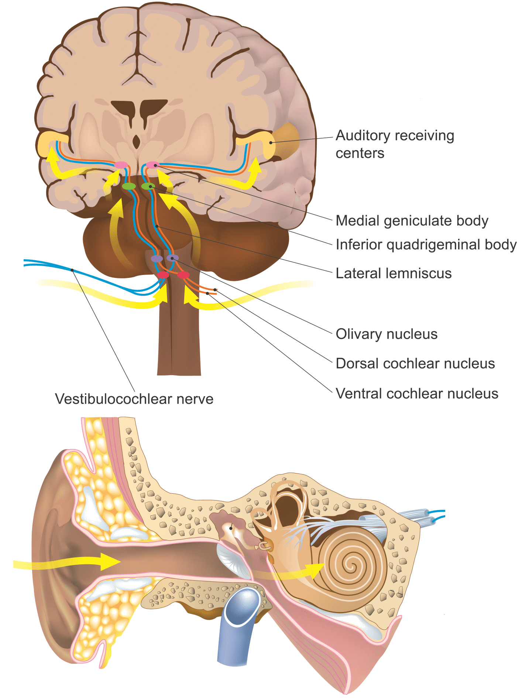


- auditory pathway overview
- desa working on anf to midbrain
- i decided to start with the inputs, so cochlea simulation
- stills taken from [CrashCourse](https://www.youtube.com/@crashcourse) and [wikipedia](https://en.wikipedia.org/wiki/Hair_cell)

---


<!-- 
formed of three parts...
here's my opinion on the external ear, for our purposes.
the external ear has three basic functions:
1. channel sound waves inside the ear canal
2. characterize sound elevation
3. characterize front-back difference
-->
---


<!-- 
the middle ear is characterized by three ossicles...
it is also, interestingly, a closed chamber, can be opened by swallowing, blowing into your nose, chewing. an example is if you've ever been diving
we've seen the three ossicles before!
the stapes "knocks" on the oval window, against the labyrinth.
the amplification given by the ossicles is necessary because moving a sound through liquid, like in the labyrinth, is harder than through air.
-->
---


---
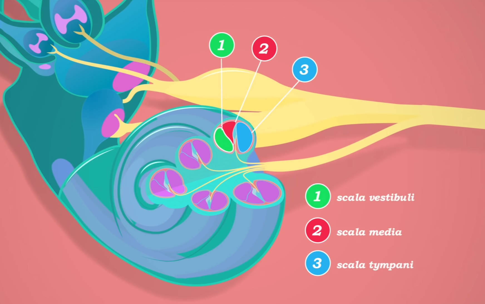

---
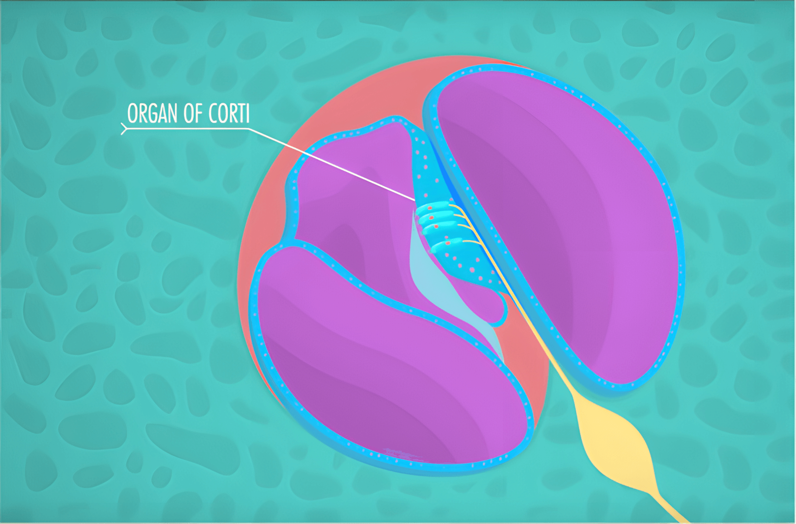
<!-- basilar membrane -->
---

<!-- basilar membrane resonates tonotopically -->
---


---


<!-- here's another image, from the side -->
---


<!-- you'll notice that there are two types of hair cells, outer hair cells and inner hair cells -->
---


<!-- 
inner hair cells are very innervated, about 10 cochlear nerve fibers per hair cell, while outer hair cells are much less innervated, as one cochlear nerve fiber innervates multiple of them.
outer hair cells actually have a very specific function: they non-linearly compress the audible range about a million to a hundred
-->

---
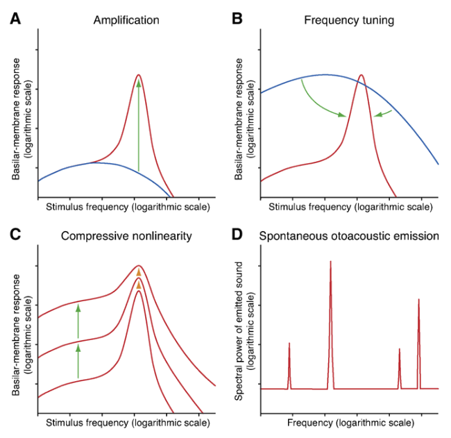
<!-- the threshold is 0.1nm -> 0dB; loudest is 10nm -> 120dB -->

---
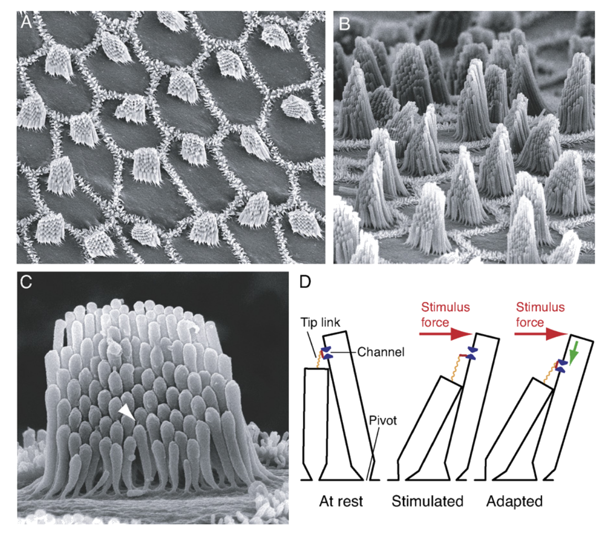
Sensory epithelium of the chicken cochlea:
- hexagonal array of short hair cells bordered supporting cells
- deflecting causes depolarization

(Hudspeth, 2008)

--- 

1. Deflection of the bundle bends the stereociliary pivots, tenses the tip link, and opens the transduction channel
2. $K^+$ and $Ca^{2+}$ enter the cytoplasm and depolarize the hair cell
3. $Ca^{2+}$ interacts with a molecular motor and slips down, lowering tension

(Hudspeth, 2008)

---
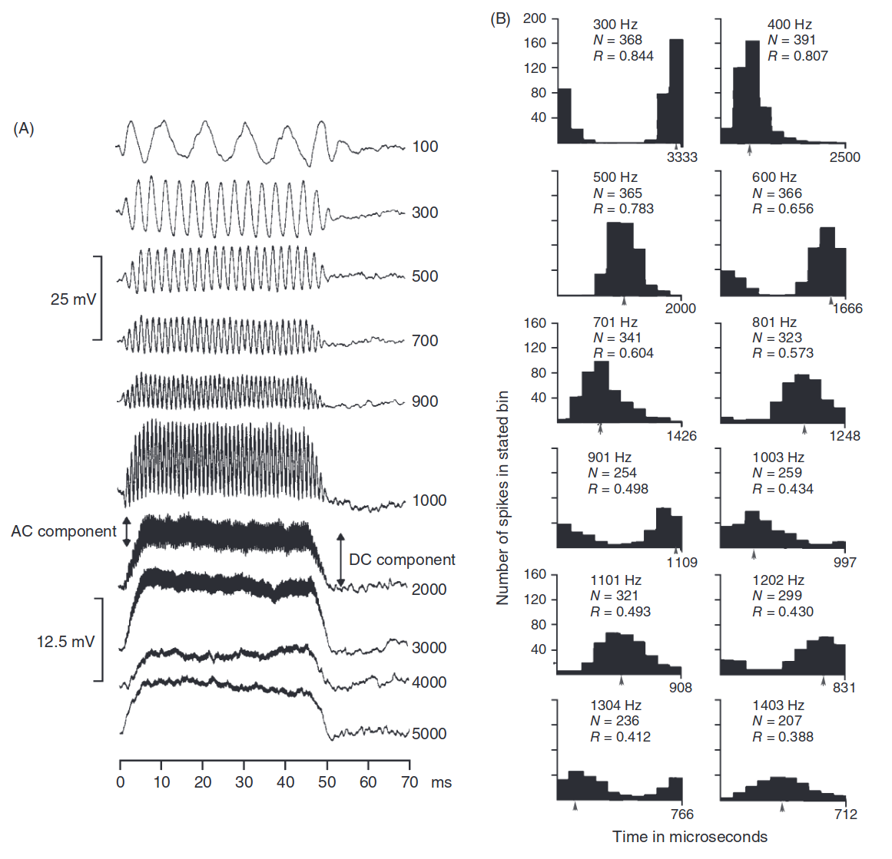
- cells depolarize and polarize according to the sound phase
- this corresponds to an AC component paired with a DC component
- low frequencies (below 5Hz) -> just AC
- ANFs at low frequencies are *phase locked*

(Yin et al., 2019)

---
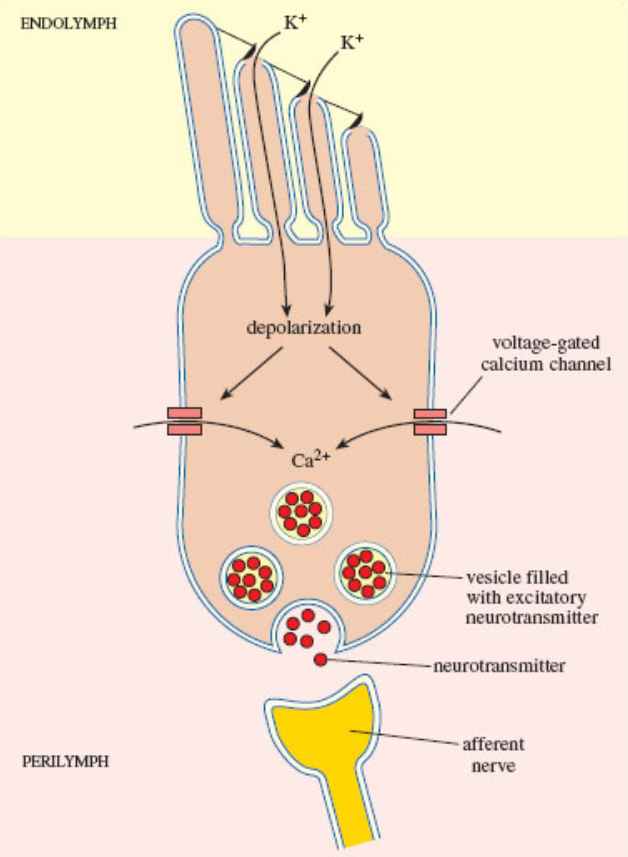
- although inner hair cells depolarize, they do not produce an action potential, but a _graded potential_
- the depolarization causes release of glutamate in ribbon synapse
- glutamate stimulates action potential in type I fibers
<br/>
<span class="text-small">image from [here](openlearn.open.ac.uk/mod/resource/view.php?id=263162)</span>

---
<div class="twocols mt-0">
<div class="mt-0">

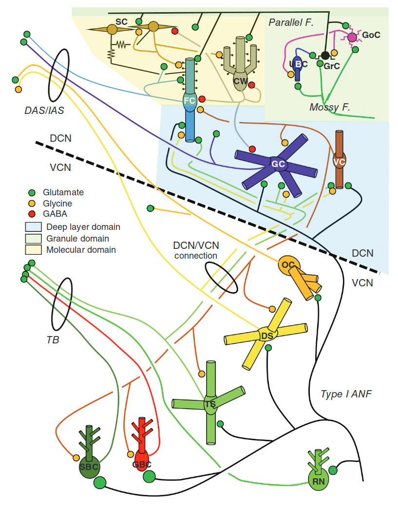
</div>
<div class="mt-0">

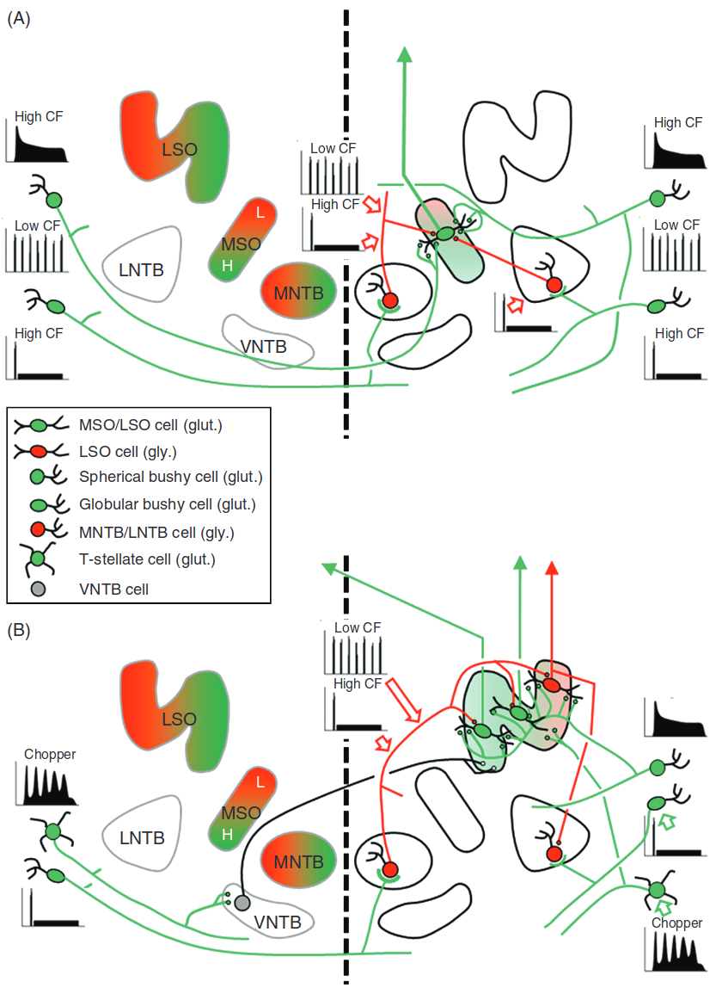

</div>
</div>
<!-- 
which then connect to a variety of different cell types and go on to reach the superior olivary complex, which is outside of today's scope
-->

---

# simulation

3. simulation
    - nest and architecture
    - brian2-brian2hears
    - my implementation and workflow
4. conclusion
5. feature steps

---

# how do we simulate (code) this?
<br/>
<div class="twocols">
<div>

## ear section

- HRTF
- cochlea (IHC)

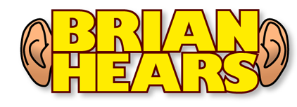
</div>
<div>

## neural section
- single neurons/synapses with varying characteristics
- entire populations 


</div>
</div>

---

## neural section
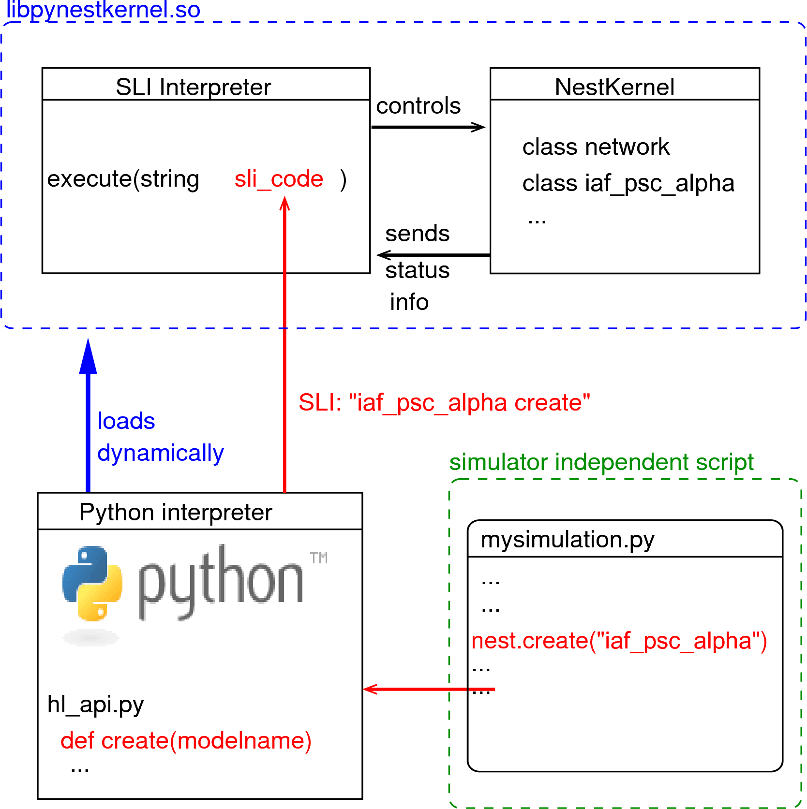
- NEST is a simulator for spiking neural network
- the actual simulator, written in C++, has an SLI interface
- `pyNEST` is an interface for NEST (specifically for its SLI)
- currently using desa's code in full <3

<!-- 
this means that whenever you're creating a population or connecting two with synapses, your objects only exist in the nest kernel, while python serves only as your API. a little bit like controlling a server from your laptop
 -->
---

## ear section
- `brian2hears` is a (mature) auditory modelling library
- designed to be used with `brian2`, another simulator, or standalone
- provides 
    - elementary HRTF support
    - cochlea models as well as pieces to build your own
    - sound handling (filters, default sounds...)
    - full python implementation:
        - somewhat slow
        - inspectable!

---
### cochlea modeling elements
<br/>
<center>

| cochlea  | modelling   | 
|:-------------- | --------------:| 
| tonotopic organization    | erbspace     |
| approximate frequency    | gammatone     |
| OHC/active hearing    | compression     |
| limited frequency range | refractory period | 

</center>

most importantly:
 we can use the sound itself as the **driving variable** in a neuron model!

---


#### resulting scheme

---

<!-- _class: invert -->

### basic implementation

```python
cfmin, cfmax, cfN = 20*Hz, 20*kHz, 3000
cf = erbspace(cfmin, cfmax, cfN)
sound = Sound.whitenoise(100*ms)
gfb = Gammatone(sound, cf)
ihc = FunctionFilterbank(gfb, lambda x: 3*clip(x, 0, Inf)**(1.0/3.0))
# Leaky integrate-and-fire model with noise and refractoriness
eqs = '''
dv/dt = (I-v)/(1*ms)+0.2*xi*(2/(1*ms))**.5 : 1 (unless refractory)
I : 1
'''
G = FilterbankGroup(ihc, 'I', eqs, reset='v=0', threshold='v>1', refractory=5*ms)
# Run, and raster plot of the spikes
M = SpikeMonitor(G)
run(sound.duration)
plot(M.t/ms, M.i, '.')
show()
```
---

### results:


<!-- 
as these are just spikes, spike generators can be initialized in nest to fire accordingly. leaving us with a full-nest network.
-->

---

## reality check
<br/>

1) implemented, but no comparisons with existing inputs yet
2) cochlea is still a very simple model
3) `brian2hears` is pretty slow, so I created all spike trains at once
4) "default" HRTFs have limited angles, while more recent ones leave complete control

---

# future steps

* produce some results! compare with existing inputs
* compare with more complete cochlea models
* move to more standard HRTFs (stop using `brian2hears` integrated IRCAM database)
* can we also simulate dynamical properties of sound localization with synaptic plasticity? what about the adaptation we saw in IHCs? and localizing two sounds next to each other?