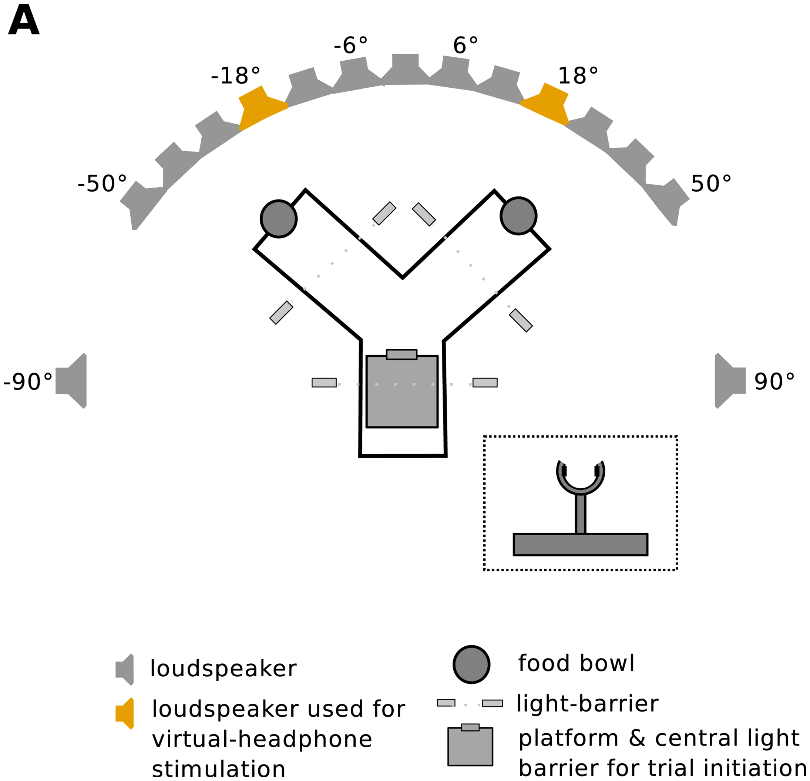
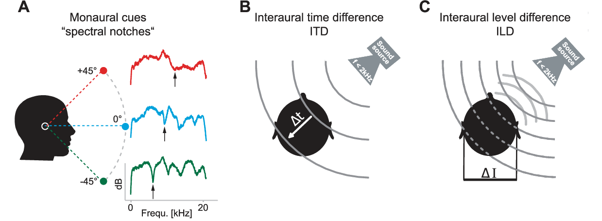
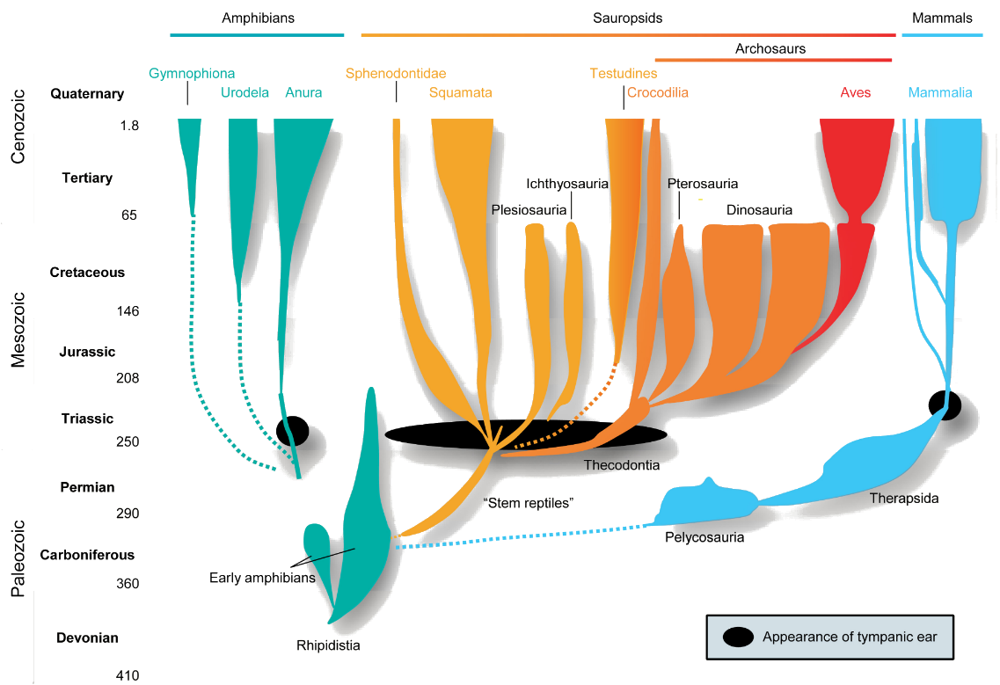

intro-anato-simul:IHC-conclu

# Sound Localization Basics
auth: Paolo Marzolo
adv:  Francesco De Santis

---
# Table of contents

1. introduction
    - task definition
    - why it's interesting
    - basic concepts
1. anatomical 
    - overall structure
    - my part

3. simulation
    - nest and architecture
    - brian2-brian2hears
    - my implementation and workflow
4. conclusion

---
# Introduction
- double presentation
- objectives:
    - familiarize audience with the subjects
    - present what i've been working on
    - get some more presentation practice
- feedback welcome!

---
## Task definition
> The ability to identify the location of a sound source in a sound field. (Jutras et al., 2020)

### humans
- report verbally (Wightman and Kistler, 1992)

---

> a subject might call out the coordinates "minus 45, 30," indicating that the sound came from 45° to the left of the subject and from 30° above the horizontal plane.
\
(Wightman and Kistler, 1992)

---
## Task definition
> The ability to identify the location of a sound source in a sound field. (Jutras et al., 2020)

### humans
- report verbally (Wightman and Kistler, 1992)
- nose pointing (Makous and Middlebrooks, 1990)

---
## Task definition
> The ability to identify the location of a sound source in a sound field. (Jutras et al., 2020)

### humans
- report verbally (Wightman and Kistler, 1992)
- nose pointing (Makous and Middlebrooks, 1990)
- God's eye (Gilkey et al., 1995)

---

---
## Task definition
> The ability to identify the location of a sound source in a sound field. (Jutras et al., 2020)

### humans
- report verbally (Wightman and Kistler, 1992)
- nose pointing (Makous and Middlebrooks, 1990)
- God's eye (Gilkey et al., 1995)

### other mammals
- mostly MAA:
    - 2AFC

---

(Tolnai et al., 2017) - virtual headphones

---
## Task definition
> The ability to identify the location of a sound source in a sound field. (Jutras et al., 2020)

### humans
- report verbally (Wightman and Kistler, 1992)
- nose pointing (Makous and Middlebrooks, 1990)
- God's eye (Gilkey et al., 1995)

### other mammals
- mostly MAA:
    - 2AFC
- 6 AFC alternative for SNR

---

(Lingner et al., 2012) - sound localization SNR

---
## why it's interesting
  

1. point-like sensor to spatial
1. limited cues are enough to accomplish it
1. evolutionary perspective

---
## why it's interesting
1. point-like sensor to spatial -> consider vision and somatosensation
1. limited cues are enough to accomplish it
1. evolutionary perspective
---

## why it's interesting

1. point-like sensor to spatial -> consider vision and somatosensation
1. ### limited cues are enough to accomplish it
    - 3 classes of cues: ITD, ILD, spectral

---
 

(Grothe and Pecka, 2014)

---
## why it's interesting

1. point-like sensor to spatial -> consider vision and somatosensation
1. ### limited cues are enough to accomplish it
    - 3 classes of cues
    * spectral cues don't change in horizontal -> binaural
    * small ranges: ITD $\in [\pm 0.6 \micro s ]$, ILD $\in [\pm 50dB ]$
    * ITD viable in larger heads, ILD frequency dependent
        - ILD high freq affected most (Rayleigh, 1875)
        - for humans, viable >1.3 kHz 

---
TODO: HRTF!

---

## why it's interesting

1. point-like sensor to spatial -> consider vision and somatosensation
1. limited cues are enough to accomplish it
3. ### evolutionary perspective
    * independent evolution (Grothe and Pecka, 2014)

---

<!-- this also means possibly independent solutions! -->

---

<!-- ## why it's interesting

1. point-like sensor to spatial -> consider vision and somatosensation
1. limited cues are enough to accomplish it
3. ### evolutionary perspective
    - independent evolution (Grothe and Pecka, 2014)
    - diets changed to seeds, depriving three ossicles of their function
    * only small, nocturnal mammals survived
    * mother-pup communication calls outside reptilian-bird hearing range

---

1. anatomical 
    - overall structure
    - my part

3. simulation
    - nest and architecture
    - brian2-brian2hears
    - my implementation and workflow
4. conclusion -->

---
# what are we doing? what am i doing?
- what is our role? validating a model
- 
---

# how do we code this?

---

<!-- _class: -->